 
 

  

# 👋 Hello, I'm Gabriel.

### Python Developer | Data Engineering | Artificial Intelligence | Cybersecurity

---

## About Me:

I am a software developer and data engineer specializing in backend architecture, pipeline construction, and **automation (RPA)**. Currently, I am building and structuring **Dexion-Labs**, a company focused on consolidating high-level solutions in data engineering, software engineering, and the automation of complex processes.

---

---
### About DEXION-LABS
---

Dexion-Labs is the embodiment of my technical approach to infrastructure and code. The company's goal is to design and implement scalable systems through three pillars:
.
- **Data Engineering**: Architecture of ETL/ELT pipelines, extraction and processing of large volumes of data.

- **Automation** (RPA): Development of orchestrated automation frameworks.

- **Software Engineering**: Building distributed systems and resilient backend architectures.

 
---

### Technologies

---

### Backend

### Database

### Cloud & Tools

---

# Statistics

---

<h6> 
 <i>  Contatos:</i> 
 </h6>

  

  
  
    

---

### "Temos a tendência de esquecer que nenhum computador jamais fará uma pergunta nova.."
##### "We've tended to forget that no computer will ever ask a new question."
#### Grace Hopper.

Thank you for visiting my profile!

